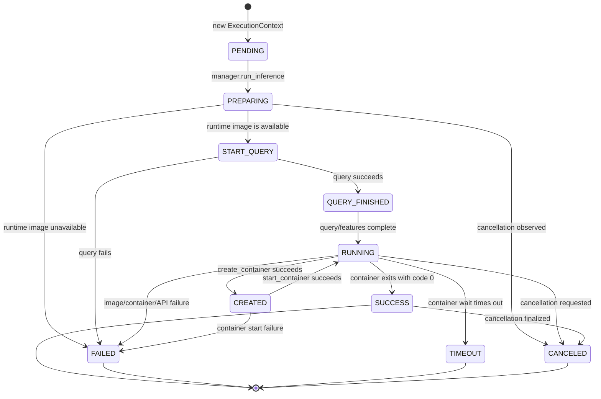

# Execution state lifecycle

This document describes the execution lifecycle represented by
`MELD/ModelEnvironment/execution_context.py`. It combines the enum with the
status writers in the execution service, manager, inference runner, and Docker
runtime helpers.

## Current state diagram

Solid transitions below are produced by the current execution code. The state
names are persisted as the enum values in `status/status.json`.

`CREATED` appears after an earlier `RUNNING` write because
`InferenceRunner.run()` marks the execution as running before
`create_container()` writes `CREATED`. `start_container()` then writes
`RUNNING` again. `SUCCESS` and `FAILED` can also be written more than once by
the wait helper and the inference runner.

## State inventory

| State | Current writer | Current role |
| --- | --- | --- |
| `PENDING` | `ExecutionContext.__init__()` | Initial state for a newly created execution. |
| `PREPARING` | `ModelManager.manager.run_inference()` | Contract and runtime preparation phase. |
| `CREATED` | `docker_runtime.create_container()` | Runtime container was created. |
| `RUNNING` | `InferenceRunner.run()`, `docker_runtime.start_container()` | Runtime execution is active. |
| `SUCCESS` | `docker_runtime.wait_for_container()`, `InferenceRunner.run()` | Container exited successfully. |
| `FAILED` | Image lookup, image-size lookup, container creation/start/stop, and wait paths | A runtime or infrastructure operation failed. |
| `TIMEOUT` | `docker_runtime.wait_for_container()` | Container wait exceeded its timeout. |
| `CANCELED` | `ExecutionService.cancel_execution()` and execution finalizers | Cancellation was requested or observed. |
| `START_QUERY` | `ModelManager.manager.query_data()` | Query execution has started. |
| `QUERY_FINISHED` | `ModelManager.manager.query_data()` | Query execution completed successfully. |

## Execution flow by subsystem

`ExecutionService.start_execution()` validates the contract, creates an
`ExecutionContext`, and submits `ModelManager.manager.run_inference()` to a
single-worker executor. Context construction creates the execution directory
and writes `PENDING`.

The manager writes `PREPARING`, verifies the runtime image, calculates the
query window, records `START_QUERY` and `QUERY_FINISHED` around the data
warehouse query, validates and normalizes features, and then invokes the
inference runner. Image verification does not change `ExecutionStatus`.

The inference runner writes `RUNNING`, obtains the image size, creates the
runtime container, copies input data, starts the container, waits for its exit,
and packages the result, logs, input, and metrics. Docker helpers write
`CREATED`, `RUNNING`, `SUCCESS`, `FAILED`, and `TIMEOUT` at the corresponding
runtime boundaries.

Cancellation uses a shared event and an optional callback. The service marks
the context `CANCELED` immediately, while the runner and manager write it
again during finalization when the event is observed.

Contract image installation is a separate lifecycle. `ContractService` stores
string statuses such as `pulling`, Docker event statuses, `available`, and
`failed`, together with numeric progress, and exposes them as `installing` or
`ready` through the contract API. Those statuses do not use the
`ExecutionStatus` enum.

## Persistence and API observations

- `ExecutionContext.set_status()` persists the enum value together with
  `lastUpdated` and `jobId` in `status/status.json`.
- Reloading an execution through `ExecutionContext.create(..., execution_id)`
  assigns the decoded JSON object to `ctx.status`, whereas a live context holds
  an `ExecutionStatus` value. Consumers therefore see two different in-memory
  status shapes.
- The execution HTTP resource checks `ctx.status == "completed"`, but the
  persisted execution values are uppercase enum strings such as `SUCCESS`, and
  reloaded status is a dictionary. The result-archive branch is therefore not
  selected by the current implementation.
- `ExecutionService.get_executions()` finds nested `status.json` files but uses
  the status directory name as `execution_id`; the execution directory is one
  level above it.
- `ExecutionService.read_log()` opens the literal `*.log` path, while
  `stream_log()` expands the wildcard. Completed log retrieval therefore does
  not use the same file-discovery behavior as streaming retrieval.
- `InferenceRunner` marks a run `SUCCESS` before extracting and validating the
  output. If a later result-processing step fails, the surrounding exception
  handler logs the error without necessarily replacing the earlier success
  state.

These observations describe the current implementation and are included so
the diagram is not mistaken for a future-state contract.
